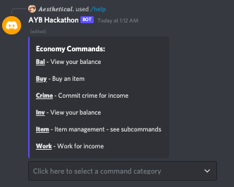
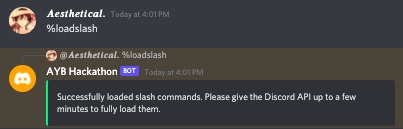

# Commands
EvoluBot's commands are listed below, though please note that the only text command, (``<adminprefix>loadslash``) is not listed due to limited use. Subcommands are also listed, on their individual commands. ``[]`` denotes an optional field, ``{}`` denotes a required field.

**Economy:**
> - bal [user]
> - buy {item} {amount}
> - crime
> - inv [user]
> - item [item_name]
>> - item create {name} {price} [description]
>> - item delete {name}
>> - item edit {name} {new_name} {new_price} [new_description]
>> - item view [name]
> - work
> - addmoney {user} {amount}
> - remmoney {user} {amount}
> - sell {item} {amount}
> - give {user} {amount}

**Utility:**
> - help [command]
> - ping
> - setmanager {role}

