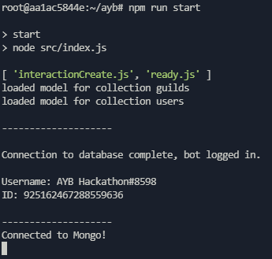

# Setup Instructions:

Any device or server which runs Linux/MacOS/Windows should be able to run the bot using the below instructions. See troubleshooting below the setup guide.

## Hosting Instructions:
1. Install prerequisite software if you do not already have it -
    * [Node.js](https://nodejs.org/)
    * [Git](https://git-scm.com/)
2. Clone this repository - ``git clone https://github.com/Aesth3tical/AYB-Hackathon-2021``
3. Make a copy of ``.env.example`` file in your bot workspace, taking off the ``.example`` portion and fill it in
    * *Note that the ``ADMIN_PREFIX`` variable is the prefix which would be used to initialize the bot's slash commands for use. No other general commands on the bot use text, so only the user with their ID set as the ``OWNER`` env variable will be able to load slash commands.*
4. Don't forget to save before continuing!
5. Open a console/terminal and run ``npm run build``, followed by ``npm run start`` when that's done.
6. If the output looks similar to the screenshot below, your bot should be responsive!
    * 

## Troubleshooting:
It isn't letting me clone the repository!
> - Make sure you have a valid GIT installation, as required in step 1 of the Hosting guide.

I'm unable to load in the slash commands!
> - Make sure that your Discord userID is assigned to the value of ``OWNER`` in your ``.env`` file. Otherwise it will not work, since only that user can run the command.

The slash commands aren't showing up!
> - Make sure you put the right Discord guildID as the value of ``GUILDID`` in your ``.env`` file. Since the bot is only designed to run on a single server, only that server will have the commands added.

The bot isn't running on my device!
> - Then that device is obviously incompatible with the bot, please note that I was unable to test on every possible device and software to determine which ones would run the bot, however it should work on most machines including repl.it.